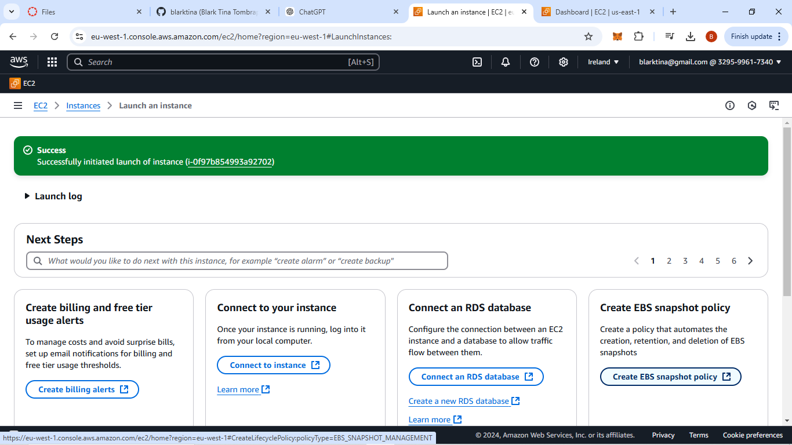

# blarktina-Lita-EC2-Instance-Project
## This project documents the process of how I launched an EC2 instance to host the Apache web server for smartshop
### Keypair creation
#### I created a keypair for the EC2 instance, below is the keypair details 


### Security group creation
#### I create a security group for the EC2 instance, below is the details of the security group I created


### The EC2 instance launched
#### while createing the EC2 instance I Named my EC2 intance, I made use of the VPC that was created for me.The EC2 is seated on Amazonlinux2AMI and the EC2 type is t2.micro. below are the details of the EC2 instance launched





### Apache Web Server Installation
#### I Run the following commands on the EC2 instance:

```bash
sudo yum update -y
sudo yum install httpd -y
sudo systemctl start httpd
sudo systemctl enable httpd
below is the details of the Apache webserver installation
```


